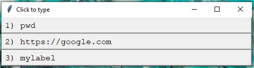

# auto-typer
Simple interface for sending keystrokes into environments where pasting is not possible

With these contents of commands.txt..
    
    pwd
    https://google.com
    secret command#label:mylabel

Running typer.pyw produces this window:

Simply click one of the commands, and after DELAY seconds, it will be transcribed into keystrokes.